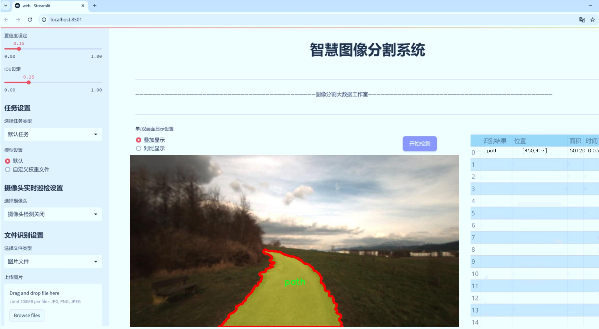
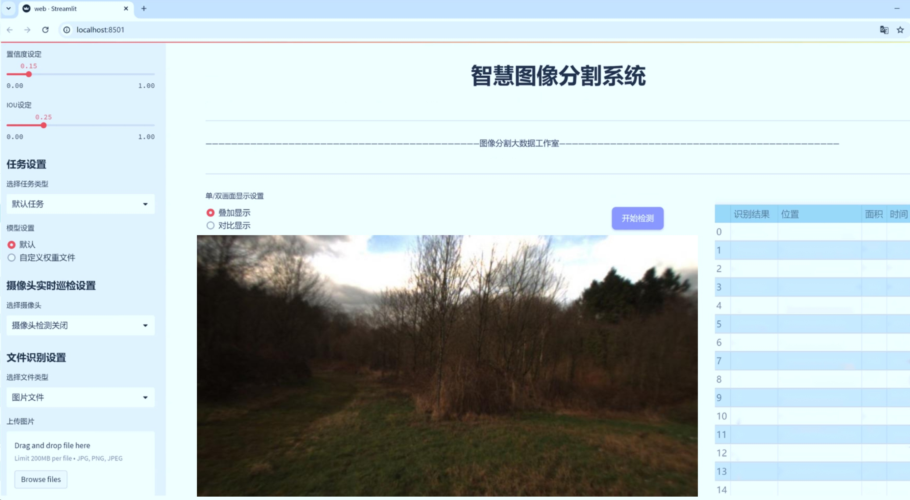
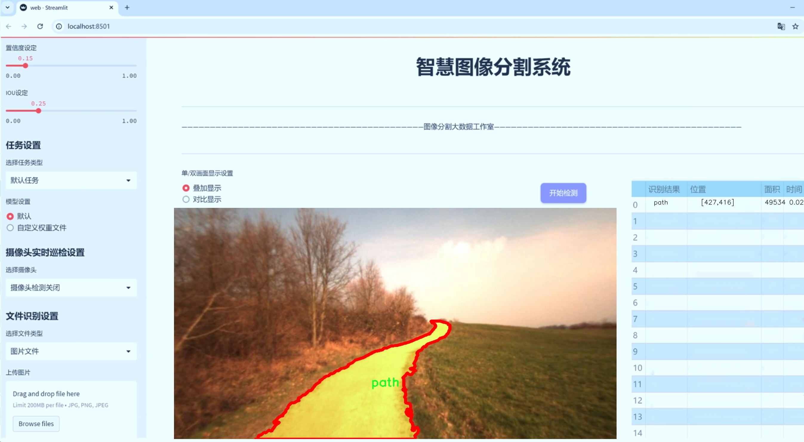
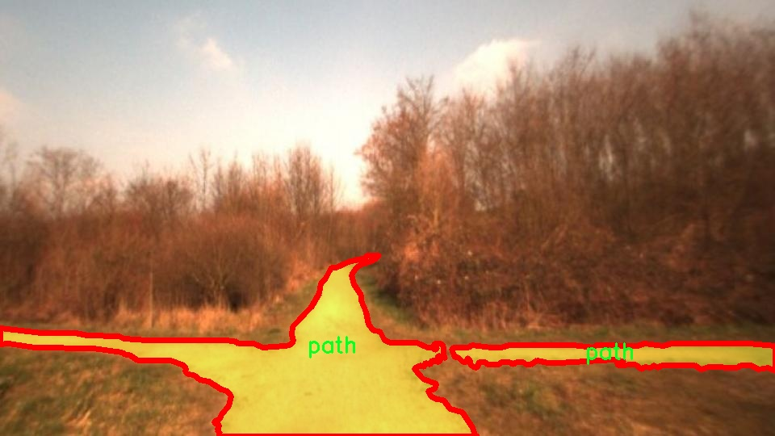
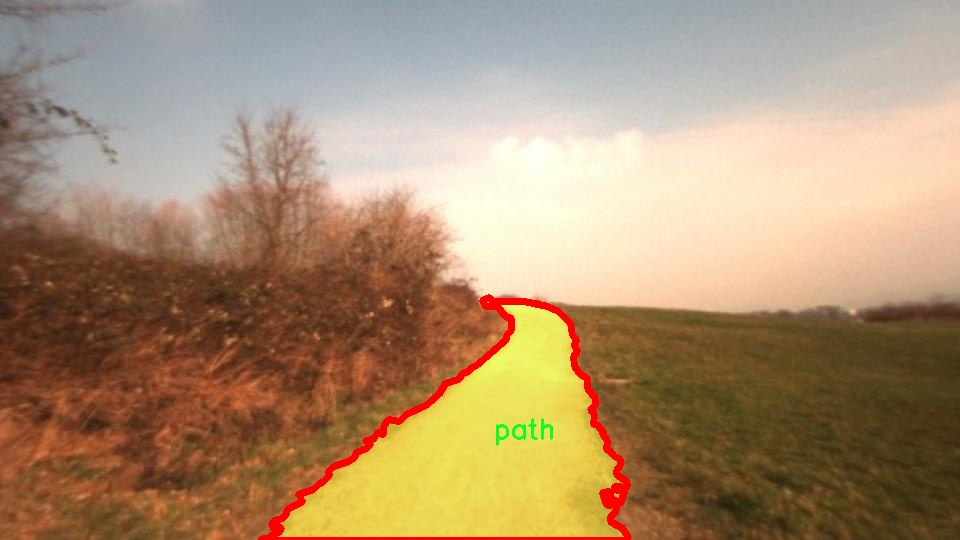
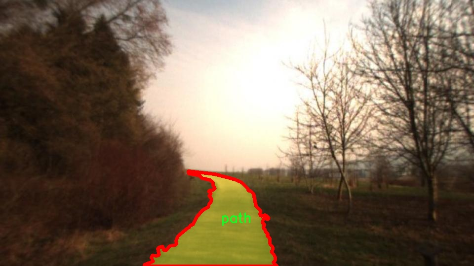
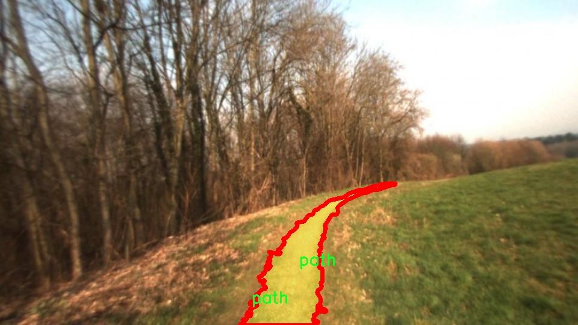
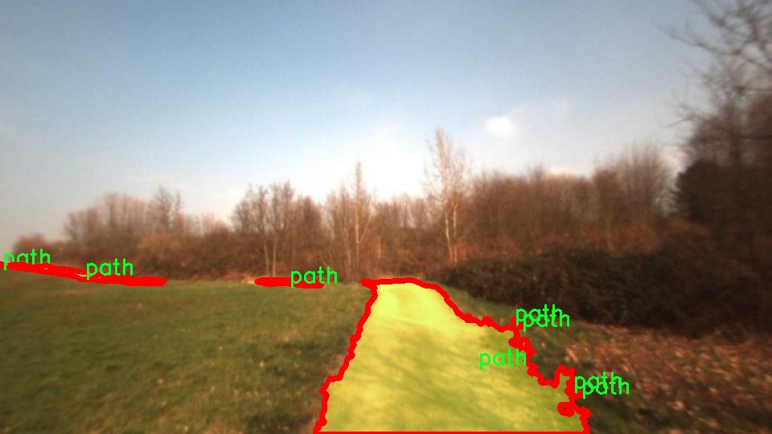

# 乡村小道图像分割系统源码＆数据集分享
 [yolov8-seg-C2f-Faster-EMA＆yolov8-seg-HGNetV2等50+全套改进创新点发刊_一键训练教程_Web前端展示]

### 1.研究背景与意义

项目参考[ILSVRC ImageNet Large Scale Visual Recognition Challenge](https://gitee.com/YOLOv8_YOLOv11_Segmentation_Studio/projects)

项目来源[AAAI Global Al lnnovation Contest](https://kdocs.cn/l/cszuIiCKVNis)

研究背景与意义

随着全球城镇化进程的加速，乡村地区的生态环境和交通基础设施面临着前所未有的挑战。乡村小道作为连接村庄与外界的重要通道，不仅承载着农民的日常出行和农产品运输，也在乡村旅游和生态保护中发挥着重要作用。然而，传统的乡村小道往往缺乏有效的管理和维护，导致道路损坏、植被过度生长等问题，严重影响了乡村的可持续发展。因此，如何有效地监测和管理乡村小道，成为了当前研究的热点之一。

近年来，计算机视觉技术的快速发展为乡村小道的监测提供了新的解决方案。尤其是基于深度学习的图像分割技术，能够在复杂的自然环境中实现高精度的目标检测与分割。YOLO（You Only Look Once）系列模型因其高效的实时检测能力，已广泛应用于各种场景。然而，YOLOv8作为该系列的最新版本，虽然在精度和速度上都有了显著提升，但在特定的乡村小道环境下，仍然面临着一些挑战，如复杂背景、光照变化和物体遮挡等问题。因此，改进YOLOv8以适应乡村小道图像分割的需求，具有重要的理论和实践意义。

本研究基于“offroad-dataset-ii-instance”数据集，构建了一套针对乡村小道的图像分割系统。该数据集包含1400张图像，涵盖14个类别，包括背景、密集植被、草地、高植被、不可通行的低植被、物体、障碍物、小道、水坑、粗糙小径、天空、平滑小径、可通行的草地和植被等。这些类别的多样性使得模型在训练过程中能够学习到丰富的特征，从而提高分割的准确性和鲁棒性。

通过对YOLOv8模型的改进，我们期望能够在乡村小道的图像分割任务中，提升模型对不同类别的识别能力，尤其是在复杂环境下的表现。研究的意义不仅在于推动计算机视觉技术在乡村小道监测中的应用，还在于为乡村可持续发展提供数据支持和决策依据。通过精确的图像分割，管理者可以更好地识别和评估乡村小道的状况，制定相应的维护和管理策略，从而促进乡村经济的发展和生态环境的保护。

此外，本研究还将为相关领域的研究提供参考，推动乡村交通基础设施智能化管理的发展。随着技术的不断进步，未来的乡村小道监测系统有望实现更高的自动化水平，为乡村振兴战略的实施提供强有力的技术支持。因此，基于改进YOLOv8的乡村小道图像分割系统的研究，不仅具有重要的学术价值，也将为实际应用带来深远的影响。

### 2.图片演示







##### 注意：由于此博客编辑较早，上面“2.图片演示”和“3.视频演示”展示的系统图片或者视频可能为老版本，新版本在老版本的基础上升级如下：（实际效果以升级的新版本为准）

  （1）适配了YOLOV8的“目标检测”模型和“实例分割”模型，通过加载相应的权重（.pt）文件即可自适应加载模型。

  （2）支持“图片识别”、“视频识别”、“摄像头实时识别”三种识别模式。

  （3）支持“图片识别”、“视频识别”、“摄像头实时识别”三种识别结果保存导出，解决手动导出（容易卡顿出现爆内存）存在的问题，识别完自动保存结果并导出到tempDir中。

  （4）支持Web前端系统中的标题、背景图等自定义修改，后面提供修改教程。

  另外本项目提供训练的数据集和训练教程,暂不提供权重文件（best.pt）,需要您按照教程进行训练后实现图片演示和Web前端界面演示的效果。

### 3.视频演示

[3.1 视频演示](https://www.bilibili.com/video/BV16o1AYhE1w/)

### 4.数据集信息展示

##### 4.1 本项目数据集详细数据（类别数＆类别名）

nc: 1
names: ['path']


##### 4.2 本项目数据集信息介绍

数据集信息展示

在本研究中，我们采用了名为“offroad-dataset-ii-instance”的数据集，以支持对乡村小道图像分割系统的训练，旨在改进YOLOv8-seg模型的性能。该数据集专注于乡村环境中的小道识别与分割，具有重要的应用价值，尤其是在自动驾驶、环境监测和农业管理等领域。通过对乡村小道的精准分割，我们能够为相关领域提供更为可靠的数据支持，从而提升决策的科学性与有效性。

“offroad-dataset-ii-instance”数据集的设计理念是为了解决传统图像分割任务中存在的挑战，尤其是在复杂的自然环境中。该数据集的类别数量为1，具体类别为“path”，这意味着数据集专注于乡村小道的实例分割。尽管类别数量相对较少，但这一单一类别的深度和多样性使得数据集在训练模型时能够聚焦于特定的任务，减少了类别间的干扰，进而提高了模型的学习效率和分割精度。

数据集中的图像来源于不同的乡村场景，涵盖了多种天气条件、光照变化以及不同的地形特征。这种多样性确保了模型在训练过程中能够接触到各种可能的环境因素，从而增强其在实际应用中的鲁棒性。例如，数据集中可能包含阳光明媚的日子、阴雨天气以及不同季节的场景，这些因素都会影响小道的外观和可见性。通过这种方式，模型能够学习到更为全面的特征，从而在实际应用中表现出更强的适应能力。

在数据集的构建过程中，标注团队对每一幅图像进行了细致的标注，确保每个小道的边界清晰可辨。这种高质量的标注不仅提高了数据集的可靠性，也为后续的模型训练提供了坚实的基础。标注的准确性直接影响到模型的训练效果，因此在数据集的制作过程中，团队采用了严格的质量控制标准，以确保每个标注的准确性和一致性。

为了进一步提升模型的训练效果，我们在数据预处理阶段对图像进行了多种增强操作，包括旋转、缩放、翻转和颜色调整等。这些操作不仅增加了数据集的多样性，还帮助模型更好地学习到小道的特征，使其在面对不同的输入时能够保持较高的分割精度。此外，数据集还提供了多种分辨率的图像，以适应不同的训练需求和计算资源。

总之，“offroad-dataset-ii-instance”数据集为乡村小道图像分割系统的训练提供了丰富而高质量的数据支持。通过对该数据集的深入分析与应用，我们期待能够显著提升YOLOv8-seg模型在乡村小道分割任务中的表现，为相关领域的研究与应用提供有力的技术支持。随着模型的不断优化与迭代，我们相信这一数据集将为未来的研究奠定坚实的基础，推动乡村环境智能化管理的发展。











### 5.全套项目环境部署视频教程（零基础手把手教学）

[5.1 环境部署教程链接（零基础手把手教学）](https://www.bilibili.com/video/BV1jG4Ve4E9t/?vd_source=bc9aec86d164b67a7004b996143742dc)


[5.2 安装Python虚拟环境创建和依赖库安装视频教程链接（零基础手把手教学）](https://www.bilibili.com/video/BV1nA4VeYEze/?vd_source=bc9aec86d164b67a7004b996143742dc)

### 6.手把手YOLOV8-seg训练视频教程（零基础小白有手就能学会）

[6.1 手把手YOLOV8-seg训练视频教程（零基础小白有手就能学会）](https://www.bilibili.com/video/BV1cA4VeYETe/?vd_source=bc9aec86d164b67a7004b996143742dc)


按照上面的训练视频教程链接加载项目提供的数据集，运行train.py即可开始训练



     Epoch   gpu_mem       box       obj       cls    labels  img_size
     1/200     0G   0.01576   0.01955  0.007536        22      1280: 100%|██████████| 849/849 [14:42<00:00,  1.04s/it]
               Class     Images     Labels          P          R     mAP@.5 mAP@.5:.95: 100%|██████████| 213/213 [01:14<00:00,  2.87it/s]
                 all       3395      17314      0.994      0.957      0.0957      0.0843

     Epoch   gpu_mem       box       obj       cls    labels  img_size
     2/200     0G   0.01578   0.01923  0.007006        22      1280: 100%|██████████| 849/849 [14:44<00:00,  1.04s/it]
               Class     Images     Labels          P          R     mAP@.5 mAP@.5:.95: 100%|██████████| 213/213 [01:12<00:00,  2.95it/s]
                 all       3395      17314      0.996      0.956      0.0957      0.0845

     Epoch   gpu_mem       box       obj       cls    labels  img_size
     3/200     0G   0.01561    0.0191  0.006895        27      1280: 100%|██████████| 849/849 [10:56<00:00,  1.29it/s]
               Class     Images     Labels          P          R     mAP@.5 mAP@.5:.95: 100%|███████   | 187/213 [00:52<00:00,  4.04it/s]
                 all       3395      17314      0.996      0.957      0.0957      0.0845


### 7.50+种全套YOLOV8-seg创新点代码加载调参视频教程（一键加载写好的改进模型的配置文件）

[7.1 50+种全套YOLOV8-seg创新点代码加载调参视频教程（一键加载写好的改进模型的配置文件）](https://www.bilibili.com/video/BV1Hw4VePEXv/?vd_source=bc9aec86d164b67a7004b996143742dc)

### 8.YOLOV8-seg图像分割算法原理

原始YOLOv8-seg算法原理

YOLOv8-seg算法是基于YOLOv8模型的一种扩展，旨在实现更为精细的目标检测与分割任务。YOLO系列自诞生以来，始终致力于将目标检测转化为回归问题，利用单一神经网络同时预测目标的位置和类别。YOLOv8作为这一系列的最新版本，吸收了前几代模型的优点，并在此基础上进行了多项创新和改进，以提高模型的性能和适用性。

YOLOv8-seg的网络结构主要由三部分组成：主干网络（Backbone）、特征增强网络（Neck）和检测头（Head）。主干网络的设计依然遵循CSP（Cross Stage Partial）思想，通过引入C2f模块替代传统的C3模块，进一步提升了特征提取的效率。C2f模块通过将输入特征图分为多个分支，并对每个分支进行卷积处理，能够有效地增强模型的梯度流信息。这种结构不仅提升了特征提取的丰富性，还在一定程度上减轻了计算负担，使得YOLOv8-seg在保持高效性的同时，能够提取到更为细致的特征。

在特征增强网络部分，YOLOv8-seg采用了快速空间金字塔池化（SPPF）结构，这一设计旨在有效地处理不同尺度的特征，提升模型对多尺度目标的适应能力。通过结合特征金字塔网络（FPN）和路径聚合网络（PAN），YOLOv8-seg能够在不同层次上融合特征信息，从而提高目标检测的精度与速度。这种结构使得模型在面对复杂场景时，能够更好地处理不同尺度和形状的目标。

检测头部分，YOLOv8-seg采用了解耦头的设计理念，将分类和回归任务分为两个独立的分支。这样的设计使得模型在进行目标定位和分类时能够更加专注于各自的任务，从而提高了模型的收敛速度和预测精度。解耦头的使用不仅提升了模型的性能，还有效地解决了复杂场景下的定位不准和分类错误的问题。

值得一提的是，YOLOv8-seg在目标检测过程中引入了无锚框（Anchor-Free）的方法。这一创新的检测方式直接预测目标的中心点和宽高比例，避免了传统锚框方法中繁琐的锚框选择和调整过程。通过这种回归方式，YOLOv8-seg能够更快地聚焦于目标位置的邻近点，使得预测框更接近于实际的边界框区域。这一特性使得YOLOv8-seg在实时检测任务中表现出色，能够满足高效性和准确性的双重需求。

在训练过程中，YOLOv8-seg也对数据增强策略进行了优化。尽管Mosaic数据增强能够提升模型的鲁棒性和泛化能力，但其在一定程度上可能会破坏数据的真实分布。因此，YOLOv8-seg在训练的最后10个epoch中停止使用Mosaic数据增强，以确保模型学习到更为真实和有效的信息。这一策略的实施，进一步提升了模型在实际应用中的表现。

通过上述改进，YOLOv8-seg在多个标准数据集上的表现均优于前代模型，尤其是在COCO数据集上，模型的mAP（mean Average Precision）得到了显著提升。这一结果表明，YOLOv8-seg不仅在检测精度上有了显著提高，同时在推理速度上也保持了良好的表现，使其成为一种极具应用价值的目标检测与分割算法。

综上所述，YOLOv8-seg算法通过对主干网络、特征增强网络和检测头的全面优化，结合无锚框检测方法和改进的数据增强策略，成功实现了目标检测与分割任务的高效性与准确性。其在复杂场景下的优越表现，使得YOLOv8-seg在智能监控、自动驾驶、机器人视觉等领域具有广泛的应用前景。随着对YOLOv8-seg算法的深入研究与实践，未来有望在更多实际应用中展现出其强大的潜力与价值。


### 9.系统功能展示（检测对象为举例，实际内容以本项目数据集为准）

图9.1.系统支持检测结果表格显示

  图9.2.系统支持置信度和IOU阈值手动调节

  图9.3.系统支持自定义加载权重文件best.pt(需要你通过步骤5中训练获得)

  图9.4.系统支持摄像头实时识别

  图9.5.系统支持图片识别

  图9.6.系统支持视频识别

  图9.7.系统支持识别结果文件自动保存

  图9.8.系统支持Excel导出检测结果数据


### 10.50+种全套YOLOV8-seg创新点原理讲解（非科班也可以轻松写刊发刊，V11版本正在科研待更新）

#### 10.1 由于篇幅限制，每个创新点的具体原理讲解就不一一展开，具体见下列网址中的创新点对应子项目的技术原理博客网址【Blog】：


[10.1 50+种全套YOLOV8-seg创新点原理讲解链接](https://gitee.com/qunmasj/good)

#### 10.2 部分改进模块原理讲解(完整的改进原理见上图和技术博客链接)【如果此小节的图加载失败可以通过CSDN或者Github搜索该博客的标题访问原始博客，原始博客图片显示正常】
### YOLOv8简介

YOLOv8是一种最新的SOTA算法，提供了N/S/M/L/X尺度的不同大小模型，以满足不同场景的需求。本章对算法网络的新特性进行简要介绍。


1）骨干网络和Neck
开发者设计了C2f模块对CSPDarkNet 53和PAFPN进行改造。相比C3模块，C2f模块拥有更多的分支跨层链接，使模型的梯度流更加丰富，显著增强了模型的特征提取能力。
2)Head部分
Head部分采用无锚框设计，将分类任务和回归任务进行了解耦，独立的分支将更加专注于其所负责的特征信息。
3）损失计算
模型使用CIOU Loss作为误差损失函数，并通过最小化DFL进一步提升边界框的回归精度。同时模型采用了TaskAlignedAssigner样本分配策略，以分类得分和IOU的高阶组合作为指标指导正负样本选择，实现了高分类得分和高IOU的对齐，有效地提升了模型的检测精度。


### D-LKA Attention简介
自2010年代中期以来，卷积神经网络（CNNs）已成为许多计算机视觉应用的首选技术。它们能够从原始数据中自动提取复杂的特征表示，无需手动进行特征工程，这引起了医学图像分析社区的极大兴趣。许多成功的CNN架构，如U-Net、全卷积网络、DeepLab或SegCaps（分割胶囊），已经被开发出来。这些架构在语义分割任务中取得了巨大成功，先前的最新方法已经被超越。

在计算机视觉研究中，不同尺度下的目标识别是一个关键问题。在CNN中，可检测目标的大小与相应网络层的感受野尺寸密切相关。如果一个目标扩展到超出这个感受野的边界，这可能会导致欠分割结果。相反，与目标实际大小相比使用过大的感受野可能会限制识别，因为背景信息可能会对预测产生不必要的影响。

解决这个问题的一个有希望的方法涉及在并行使用具有不同尺寸的多个Kernel，类似于Inception块的机制。然而，由于参数和计算要求的指数增长，将Kernel大小增加以容纳更大的目标在实践中受到限制。因此，出现了各种策略，包括金字塔池化技术和不同尺度的扩张卷积，以捕获多尺度的上下文信息。

另一个直观的概念涉及将多尺度图像金字塔或它们的相关特征表示直接纳入网络架构。然而，这种方法存在挑战，特别是在管理训练和推理时间方面的可行性方面存在挑战。在这个背景下，使用编码器-解码器网络，如U-Net，已被证明是有利的。这样的网络在较浅的层中编码外观和位置，而在更深的层中，通过神经元的更广泛的感受野捕获更高的语义信息和上下文信息。

一些方法将来自不同层的特征组合在一起，或者预测来自不同尺寸的层的特征以使用多尺度的信息。此外，出现了从不同尺度的层中预测特征的方法，有效地实现了跨多个尺度的见解整合。然而，大多数编码器-解码器结构面临一个挑战：它们经常无法在不同尺度之间保持一致的特征，并主要使用最后一个解码器层生成分割结果。

语义分割是一项任务，涉及根据预定义的标签集为图像中的每个像素预测语义类别。这项任务要求提取高级特征同时保留初始的空间分辨率。CNNs非常适合捕获局部细节和低级信息，尽管以忽略全局上下文为代价。视觉Transformer（ViT）架构已经成为解决处理全局信息的视觉任务的关键，包括语义分割，取得了显著的成功。

ViT的基础是注意力机制，它有助于在整个输入序列上聚合信息。这种能力使网络能够合并远程的上下文提示，超越了CNN的有限感受野尺寸。然而，这种策略通常会限制ViT有效建模局部信息的能力。这种局限可能会妨碍它们检测局部纹理的能力，这对于各种诊断和预测任务至关重要。这种缺乏局部表示可以归因于ViT模型处理图像的特定方式。

ViT模型将图像分成一系列Patch，并使用自注意力机制来模拟它们之间的依赖关系。这种方法可能不如CNN模型中的卷积操作对感受野内提取局部特征有效。ViT和CNN模型之间的这种图像处理方法的差异可能解释了CNN模型在局部特征提取方面表现出色的原因。

近年来，已经开发出创新性方法来解决Transformer模型内部局部纹理不足的问题。其中一种方法是通过互补方法将CNN和ViT特征结合起来，以结合它们的优势并减轻局部表示的不足。TransUNet是这种方法的早期示例，它在CNN的瓶颈中集成了Transformer层，以模拟局部和全局依赖关系。HiFormer提出了一种解决方案，将Swin Transformer模块和基于CNN的编码器结合起来，生成两个多尺度特征表示，通过Double-Level Fusion模块集成。UNETR使用基于Transformer的编码器和CNN解码器进行3D医学图像分割。CoTr和TransBTS通过Transformer在低分辨率阶段增强分割性能，将CNN编码器和解码器连接在一起。

增强局部特征表示的另一种策略是重新设计纯Transformer模型内部的自注意力机制。在这方面，Swin-Unet在U形结构中集成了一个具有线性计算复杂性的Swin Transformer块作为多尺度 Backbone 。MISSFormer采用高效Transformer来解决视觉Transformer中的参数问题，通过在输入块上进行不可逆的降采样操作。D-Former引入了一个纯Transformer的管道，具有双重注意模块，以分段的方式捕获细粒度的局部注意和与多元单元的交互。然而，仍然存在一些特定的限制，包括计算效率低下，如TransUNet模型所示，对CNN Backbone 的严重依赖，如HiFormer所观察到的，以及对多尺度信息的忽略。

此外，目前的分割架构通常采用逐层处理3D输入 volumetric 的方法，无意中忽视了相邻切片之间的潜在相关性。这一疏忽限制了对 volumetric 信息的全面利用，因此损害了定位精度和上下文集成。此外，必须认识到，医学领域的病变通常在形状上发生变形。因此，用于医学图像分析的任何学习算法都必须具备捕捉和理解这些变形的能力。与此同时，该算法应保持计算效率，以便处理3D volumetric数据。

为了解决上述提到的挑战，作者提出了一个解决方案，即可变形大卷积核注意力模块（Deformable LKA module），它是作者网络设计的基本构建模块。这个模块明确设计成在有效处理上下文信息的同时保留局部描述符。作者的架构在这两个方面的平衡增强了实现精确语义分割的能力。

值得注意的是，参考该博客引入了一种基于数据的感受野的动态适应，不同于传统卷积操作中的固定滤波器Mask。这种自适应方法使作者能够克服与静态方法相关的固有限制。这种创新方法还扩展到了D-LKA Net架构的2D和3D版本的开发。

在3D模型的情况下，D-LKA机制被量身定制以适应3D环境，从而实现在不同 volumetric 切片之间无缝信息交互。最后，作者的贡献通过其计算效率得到进一步强调。作者通过仅依靠D-LKA概念的设计来实现这一点，在各种分割基准上取得了显著的性能，确立了作者的方法作为一种新的SOTA方法。

在本节中，作者首先概述方法论。首先，作者回顾了由Guo等人引入的大卷积核注意力（Large Kernel Attention，LKA）的概念。然后，作者介绍了作者对可变形LKA模块的创新探索。在此基础上，作者介绍了用于分割任务的2D和3D网络架构。

大卷积核提供了与自注意力机制类似的感受野。可以通过使用深度卷积、深度可扩展卷积和卷积来构建大卷积核，从而减少了参数和计算量。构建输入维度为和通道数的卷积核的深度卷积和深度可扩展卷积的卷积核大小的方程如下：


具有卷积核大小和膨胀率。参数数量和浮点运算（FLOPs）的计算如下：


FLOPs的数量与输入图像的大小成线性增长。参数的数量随通道数和卷积核大小的增加而呈二次增长。然而，由于它们通常都很小，因此它们不是限制因素。

为了最小化对于固定卷积核大小K的参数数量，可以将方程3对于膨胀率的导数设定为零：


例如，当卷积核大小为时，结果是。将这些公式扩展到3D情况是直接的。对于大小为和通道数C的输入，3D情况下参数数量和FLOPs 的方程如下：


具有卷积核大小和膨胀。


利用大卷积核进行医学图像分割的概念通过引入可变形卷积得以扩展。可变形卷积可以通过整数偏移自由调整采样网格以进行自由变形。额外的卷积层从特征图中学习出变形，从而创建一个偏移场。基于特征本身学习变形会导致自适应卷积核。这种灵活的卷积核形状可以提高病变或器官变形的表示，从而增强了目标边界的定义。

负责计算偏移的卷积层遵循其相应卷积层的卷积核大小和膨胀。双线性插值用于计算不在图像网格上的偏移的像素值。如图2所示，D-LKA模块可以表示为：


其中输入特征由表示，。表示为注意力图，其中每个值表示相应特征的相对重要性。运算符  表示逐元素乘法运算。值得注意的是，LKA不同于传统的注意力方法，它不需要额外的规范化函数，如或。这些规范化函数往往忽视高频信息，从而降低了基于自注意力的方法的性能。

在该方法的2D版本中，卷积层被可变形卷积所替代，因为可变形卷积能够改善对具有不规则形状和大小的目标的捕捉能力。这些目标在医学图像数据中常常出现，因此这种增强尤为重要。

然而，将可变形LKA的概念扩展到3D领域会带来一定的挑战。主要的约束来自于需要用于生成偏移的额外卷积层。与2D情况不同，由于输入和输出通道的性质，这一层无法以深度可分的方式执行。在3D环境中，输入通道对应于特征，而输出通道扩展到，其中是卷积核的大小。大卷积核的复杂性导致沿第3D的通道数扩展，导致参数和FLOPs大幅增加。因此，针对3D情况采用了另一种替代方法。在现有的LKA框架中，深度卷积之后引入了一个单独的可变形卷积层。这种战略性的设计调整旨在减轻扩展到3D领域所带来的挑战。


2D网络的架构如图1所示。第一变种使用MaxViT作为编码器组件，用于高效特征提取，而第二变种则结合可变形LKA层进行更精细、卓越的分割。

在更正式的描述中，编码器生成4个分层输出表示。首先，卷积干扰将输入图像的维度减小到。随后，通过4个MaxViT块的4个阶段进行特征提取，每个阶段后跟随降采样层。随着过程进展到解码器，实施了4个阶段的D-LKA层，每个阶段包含2个D-LKA块。然后，应用Patch扩展层以实现分辨率上采样，同时减小通道维度。最后，线性层负责生成最终的输出。

2D D-LKA块的结构包括LayerNorm、可变形LKA和多层感知器（MLP）。积分残差连接确保了有效的特征传播，即使在更深层也是如此。这个安排可以用数学方式表示为：


其中输入特征，层归一化LN，可变形LKA注意力，深度卷积，线性层和GeLU激活函数。

3D网络架构如图1所示，采用编码器-解码器设计进行分层结构化。首先，一个Patch嵌入层将输入图像的维度从（）减小到（）。在编码器中，采用了3个D-LKA阶段的序列，每个阶段包含3个D-LKA块。在每个阶段之后，通过降采样步骤将空间分辨率减半，同时将通道维度加倍。中央瓶颈包括另一组2个D-LKA块。解码器结构与编码器相对称。

为了将特征分辨率加倍，同时减少通道数，使用转置卷积。每个解码器阶段都使用3个D-LKA块来促进远距离特征依赖性。最终的分割输出由一个卷积层产生，后面跟随一个卷积层以匹配特定类别的通道要求。

为了建立输入图像和分割输出之间的直接连接，使用卷积形成了一个跳跃连接。额外的跳跃连接根据简单的加法对来自其他阶段的特征进行融合。最终的分割图是通过和卷积层的组合产生的。

3D D-LKA块包括层归一化，后跟D-LKA注意力，应用了残差连接的部分。随后的部分采用了一个卷积层，后面跟随一个卷积层，两者都伴随着残差连接。这个整个过程可以总结如下：


带有输入特征 、层归一化 、可变形 LKA 、卷积层 和输出特征 的公式。是指一个前馈网络，包括2个卷积层和激活函数。

表7显示了普通卷积和构建卷积的参数数量比较。尽管标准卷积的参数数量在通道数较多时急剧增加，但分解卷积的参数总体较低，并且增长速度不那么快。

与分解卷积相比，可变形分解卷积增加了大量参数，但仍然明显小于标准卷积。可变形卷积的主要参数是由偏移网络创建的。在这里，作者假设可变形深度卷积的Kernel大小为（5,5），可变形深度空洞卷积的Kernel大小为（7,7）。这导致了21×21大小的大Kernel的最佳参数数量。更高效地生成偏移量的方法将大大减少参数数量。


值得注意的是，引入可变形LKA确实会增加模型的参数数量和每秒的浮点运算次数（FLOPS）。然而，重要的是强调，这增加的计算负载不会影响作者模型的整体推理速度。

相反，对于Batch-size > 1，作者甚至观察到推理时间的减少，如图7所示。例如，基于作者的广泛实验，作者观察到对于Batch-size为16，具有可变形卷积和没有可变形卷积的推理时间分别为8.01毫秒和17.38毫秒。作者认为这是由于在2D中对可变形卷积的高效实现所致。为了测量时间，使用了大小为（）的随机输入。在GPU热身周期50次迭代之后，网络被推断了1000次。测量是在NVIDIA RTX 3090 GPU上进行的。


为了充分利用性能与参数之间的权衡关系，作者在图8中可视化了在Synapse 2D数据集上报告的DSC和HD性能以及基于参数数量的内存消耗。D-LKA Net引入了相当多的参数，约为101M。这比性能第二好的方法ScaleFormer使用的111.6M参数要少。

与更轻量级的DAEFormer模型相比，作者实现了更好的性能，这证明了参数增加的合理性。大多数参数来自于MaxViT编码器；因此，将编码器替换为更高效的编码器可以减少模型参数。值得注意的是，在此可视化中，作者最初将HD和内存值都归一化到[0, 100]范围内。随后，作者将它们从100缩小，以增强更高值的表示。


### 11.项目核心源码讲解（再也不用担心看不懂代码逻辑）

#### 11.1 ultralytics\data\base.py

以下是对代码的核心部分进行的分析和详细注释。代码主要是一个用于加载和处理图像数据的基础数据集类 `BaseDataset`，它是 PyTorch 的 `Dataset` 类的子类。

```python
import glob
import math
import os
import random
from copy import deepcopy
from multiprocessing.pool import ThreadPool
from pathlib import Path
from typing import Optional

import cv2
import numpy as np
import psutil
from torch.utils.data import Dataset

from ultralytics.utils import DEFAULT_CFG, LOCAL_RANK, LOGGER, NUM_THREADS, TQDM
from .utils import HELP_URL, IMG_FORMATS

class BaseDataset(Dataset):
    """
    基础数据集类，用于加载和处理图像数据。

    参数:
        img_path (str): 包含图像的文件夹路径。
        imgsz (int, optional): 图像大小，默认为640。
        cache (bool, optional): 在训练期间将图像缓存到RAM或磁盘，默认为False。
        augment (bool, optional): 如果为True，则应用数据增强，默认为True。
        hyp (dict, optional): 应用数据增强的超参数，默认为None。
        prefix (str, optional): 日志消息中打印的前缀，默认为''。
        rect (bool, optional): 如果为True，则使用矩形训练，默认为False。
        batch_size (int, optional): 批次大小，默认为None。
        stride (int, optional): 步幅，默认为32。
        pad (float, optional): 填充，默认为0.0。
        single_cls (bool, optional): 如果为True，则使用单类训练，默认为False。
        classes (list): 包含的类的列表，默认为None。
        fraction (float): 使用的数据集的比例，默认为1.0（使用所有数据）。

    属性:
        im_files (list): 图像文件路径列表。
        labels (list): 标签数据字典列表。
        ni (int): 数据集中图像的数量。
        ims (list): 加载的图像列表。
        npy_files (list): numpy文件路径列表。
        transforms (callable): 图像转换函数。
    """

    def __init__(self, img_path, imgsz=640, cache=False, augment=True, hyp=DEFAULT_CFG, prefix='', rect=False,
                 batch_size=16, stride=32, pad=0.5, single_cls=False, classes=None, fraction=1.0):
        """使用给定的配置和选项初始化BaseDataset。"""
        super().__init__()
        self.img_path = img_path  # 图像路径
        self.imgsz = imgsz  # 图像大小
        self.augment = augment  # 是否应用数据增强
        self.single_cls = single_cls  # 是否使用单类训练
        self.prefix = prefix  # 日志前缀
        self.fraction = fraction  # 使用的数据集比例
        self.im_files = self.get_img_files(self.img_path)  # 获取图像文件
        self.labels = self.get_labels()  # 获取标签
        self.update_labels(include_class=classes)  # 更新标签以仅包含指定类
        self.ni = len(self.labels)  # 数据集中图像的数量
        self.rect = rect  # 是否使用矩形训练
        self.batch_size = batch_size  # 批次大小
        self.stride = stride  # 步幅
        self.pad = pad  # 填充
        if self.rect:
            assert self.batch_size is not None
            self.set_rectangle()  # 设置矩形形状

        # 用于缓存图像的缓冲区
        self.buffer = []  # 缓冲区大小 = 批次大小
        self.max_buffer_length = min((self.ni, self.batch_size * 8, 1000)) if self.augment else 0

        # 缓存图像
        if cache == 'ram' and not self.check_cache_ram():
            cache = False
        self.ims, self.im_hw0, self.im_hw = [None] * self.ni, [None] * self.ni, [None] * self.ni
        self.npy_files = [Path(f).with_suffix('.npy') for f in self.im_files]  # 将图像文件路径转换为npy文件路径
        if cache:
            self.cache_images(cache)  # 缓存图像

        # 图像转换
        self.transforms = self.build_transforms(hyp=hyp)  # 构建图像转换

    def get_img_files(self, img_path):
        """读取图像文件。"""
        try:
            f = []  # 图像文件列表
            for p in img_path if isinstance(img_path, list) else [img_path]:
                p = Path(p)  # 处理路径
                if p.is_dir():  # 如果是目录
                    f += glob.glob(str(p / '**' / '*.*'), recursive=True)  # 获取目录下所有图像文件
                elif p.is_file():  # 如果是文件
                    with open(p) as t:
                        t = t.read().strip().splitlines()  # 读取文件内容
                        parent = str(p.parent) + os.sep
                        f += [x.replace('./', parent) if x.startswith('./') else x for x in t]  # 转换为全局路径
                else:
                    raise FileNotFoundError(f'{self.prefix}{p} does not exist')  # 文件不存在
            im_files = sorted(x.replace('/', os.sep) for x in f if x.split('.')[-1].lower() in IMG_FORMATS)  # 过滤出图像文件
            assert im_files, f'{self.prefix}No images found in {img_path}'  # 确保找到图像文件
        except Exception as e:
            raise FileNotFoundError(f'{self.prefix}Error loading data from {img_path}\n{HELP_URL}') from e
        if self.fraction < 1:
            im_files = im_files[:round(len(im_files) * self.fraction)]  # 根据比例筛选图像文件
        return im_files

    def load_image(self, i, rect_mode=True):
        """从数据集中加载一张图像，返回 (im, resized hw)。"""
        im, f, fn = self.ims[i], self.im_files[i], self.npy_files[i]  # 获取图像、文件路径和npy文件路径
        if im is None:  # 如果图像未缓存
            if fn.exists():  # 如果npy文件存在
                try:
                    im = np.load(fn)  # 从npy文件加载图像
                except Exception as e:
                    LOGGER.warning(f'{self.prefix}WARNING ⚠️ Removing corrupt *.npy image file {fn} due to: {e}')
                    Path(fn).unlink(missing_ok=True)  # 删除损坏的npy文件
                    im = cv2.imread(f)  # 从原始文件加载图像
            else:  # 从原始文件加载图像
                im = cv2.imread(f)  # BGR格式
            if im is None:
                raise FileNotFoundError(f'Image Not Found {f}')  # 图像未找到

            h0, w0 = im.shape[:2]  # 原始高度和宽度
            if rect_mode:  # 如果是矩形模式
                r = self.imgsz / max(h0, w0)  # 计算缩放比例
                if r != 1:  # 如果大小不相等
                    w, h = (min(math.ceil(w0 * r), self.imgsz), min(math.ceil(h0 * r), self.imgsz))  # 计算新的宽高
                    im = cv2.resize(im, (w, h), interpolation=cv2.INTER_LINEAR)  # 按比例调整图像大小
            elif not (h0 == w0 == self.imgsz):  # 如果不是正方形且不等于目标大小
                im = cv2.resize(im, (self.imgsz, self.imgsz), interpolation=cv2.INTER_LINEAR)  # 拉伸图像为正方形

            # 如果训练时使用增强，则将图像添加到缓冲区
            if self.augment:
                self.ims[i], self.im_hw0[i], self.im_hw[i] = im, (h0, w0), im.shape[:2]  # 缓存图像和尺寸
                self.buffer.append(i)  # 将索引添加到缓冲区
                if len(self.buffer) >= self.max_buffer_length:  # 如果缓冲区已满
                    j = self.buffer.pop(0)  # 移除最旧的索引
                    self.ims[j], self.im_hw0[j], self.im_hw[j] = None, None, None  # 清空缓存

            return im, (h0, w0), im.shape[:2]  # 返回图像和尺寸

        return self.ims[i], self.im_hw0[i], self.im_hw[i]  # 返回缓存的图像和尺寸

    def __getitem__(self, index):
        """返回给定索引的转换标签信息。"""
        return self.transforms(self.get_image_and_label(index))  # 应用转换并返回图像和标签

    def __len__(self):
        """返回数据集中标签列表的长度。"""
        return len(self.labels)  # 返回标签数量

    def build_transforms(self, hyp=None):
        """
        用户可以在此处自定义增强。

        示例:
            ```python
            if self.augment:
                # 训练转换
                return Compose([])
            else:
                # 验证转换
                return Compose([])
            ```
        """
        raise NotImplementedError  # 需要用户实现

    def get_labels(self):
        """
        用户可以在此处自定义标签格式。

        注意:
            确保输出是一个字典，包含以下键:
            ```python
            dict(
                im_file=im_file,
                shape=shape,  # 格式: (高度, 宽度)
                cls=cls,
                bboxes=bboxes, # xywh
                segments=segments,  # xy
                keypoints=keypoints, # xy
                normalized=True, # 或 False
                bbox_format="xyxy",  # 或 xywh, ltwh
            )
            ```
        """
        raise NotImplementedError  # 需要用户实现
```

### 核心部分分析
1. **初始化方法 `__init__`**: 
   - 该方法用于初始化数据集的基本参数，包括图像路径、图像大小、是否缓存、数据增强等。它还会调用其他方法来获取图像文件和标签，并设置矩形训练的参数。

2. **获取图像文件 `get_img_files`**:
   - 该方法用于读取指定路径下的所有图像文件，并根据给定的比例筛选出部分图像。

3. **加载图像 `load_image`**:
   - 该方法用于从数据集中加载单张图像，支持从缓存或原始文件加载，并根据需要调整图像大小。

4. **获取标签 `get_labels`**:
   - 该方法用于获取标签信息，用户可以自定义标签的格式。

5. **转换方法 `build_transforms`**:
   - 该方法用于构建图像转换，用户可以在此处自定义数据增强的操作。

6. **索引方法 `__getitem__`**:
   - 该方法返回给定索引的图像和标签信息，并应用预定义的转换。

7. **长度方法 `__len__`**:
   - 该方法返回数据集中标签的数量。

通过这些核心方法，`BaseDataset` 类能够有效地管理图像数据的加载、处理和增强，为后续的模型训练提供支持。

这个文件是Ultralytics YOLO项目中的一个基础数据集类`BaseDataset`，用于加载和处理图像数据。该类继承自PyTorch的`Dataset`，主要功能是为模型训练提供图像及其对应的标签信息。

在初始化方法`__init__`中，用户可以传入多个参数来配置数据集的加载方式，包括图像路径、图像大小、是否缓存图像、数据增强选项、超参数、批量大小等。初始化过程中，类会调用`get_img_files`方法获取图像文件列表，并通过`get_labels`方法获取标签信息。同时，它还会根据用户的设置进行图像缓存和数据增强的准备。

`get_img_files`方法负责读取指定路径下的图像文件。它支持传入目录或文件列表，并能够递归查找图像文件。该方法会确保返回的文件是有效的图像格式，并根据需要限制使用的数据集大小。

`update_labels`方法用于更新标签，只保留用户指定的类别。它会根据传入的类别列表筛选标签信息，并处理单类训练的情况。

`load_image`方法负责加载指定索引的图像，并根据需要进行调整（如缩放）。如果图像已经缓存，则直接返回缓存的图像；否则，它会尝试从磁盘读取图像，并在必要时进行尺寸调整。

`cache_images`和`cache_images_to_disk`方法则用于将图像缓存到内存或磁盘，以提高后续加载的速度。`check_cache_ram`方法会检查当前系统的内存是否足够进行图像缓存。

`set_rectangle`方法用于设置YOLO检测的边界框形状为矩形，以适应不同的图像长宽比。它会根据批次大小和图像的长宽比调整图像的顺序和形状。

`__getitem__`方法是PyTorch数据集的标准接口，用于返回给定索引的图像和标签信息，并应用相应的变换。`get_image_and_label`方法则用于获取图像及其标签的详细信息。

`__len__`方法返回数据集中标签的数量，而`update_labels_info`方法则允许用户自定义标签格式。

最后，`build_transforms`和`get_labels`方法是留给用户自定义的数据增强和标签格式化的接口，用户可以根据具体需求实现这些方法。

总体来说，这个文件提供了一个灵活的框架，用于处理图像数据集，支持多种配置选项，适合用于YOLO模型的训练和评估。

#### 11.2 ui.py

```python
import sys
import subprocess

def run_script(script_path):
    """
    使用当前 Python 环境运行指定的脚本。

    Args:
        script_path (str): 要运行的脚本路径

    Returns:
        None
    """
    # 获取当前 Python 解释器的路径
    python_path = sys.executable

    # 构建运行命令，使用 streamlit 运行指定的脚本
    command = f'"{python_path}" -m streamlit run "{script_path}"'

    # 执行命令并等待其完成
    result = subprocess.run(command, shell=True)
    
    # 检查命令执行结果，如果返回码不为0，表示执行出错
    if result.returncode != 0:
        print("脚本运行出错。")


# 主程序入口
if __name__ == "__main__":
    # 指定要运行的脚本路径
    script_path = "web.py"  # 假设脚本在当前目录下

    # 调用函数运行脚本
    run_script(script_path)
```

### 代码注释说明：
1. **导入模块**：
   - `sys`：用于访问与 Python 解释器相关的变量和函数。
   - `subprocess`：用于执行外部命令和程序。

2. **`run_script` 函数**：
   - 接受一个参数 `script_path`，表示要运行的 Python 脚本的路径。
   - 使用 `sys.executable` 获取当前 Python 解释器的路径，以确保脚本在当前环境中运行。
   - 构建命令字符串，使用 `streamlit` 模块运行指定的脚本。
   - 使用 `subprocess.run` 执行命令，并等待其完成。
   - 检查命令的返回码，如果不为0，表示执行过程中出现错误，打印错误信息。

3. **主程序入口**：
   - 使用 `if __name__ == "__main__":` 确保代码块只在直接运行该脚本时执行。
   - 指定要运行的脚本路径（在此示例中为 `web.py`）。
   - 调用 `run_script` 函数，传入脚本路径以执行该脚本。

这个程序文件的主要功能是通过当前的 Python 环境来运行一个指定的脚本，具体是使用 Streamlit 来启动一个 web 应用。首先，程序导入了必要的模块，包括 `sys`、`os` 和 `subprocess`，这些模块提供了与系统交互的功能。`abs_path` 函数则用于获取文件的绝对路径。

在 `run_script` 函数中，首先获取当前 Python 解释器的路径，这样可以确保使用正确的 Python 环境来执行脚本。接着，构建一个命令字符串，这个命令会调用 Streamlit 来运行指定的脚本。命令的格式是将 Python 解释器路径与要运行的脚本路径结合起来，形成一个完整的命令。

然后，使用 `subprocess.run` 方法来执行这个命令。该方法会在一个新的 shell 中运行命令，并等待其完成。如果脚本运行过程中出现错误，返回的 `returncode` 将不为零，此时程序会打印出“脚本运行出错”的提示信息。

在文件的最后部分，使用 `if __name__ == "__main__":` 语句来确保只有在直接运行该文件时才会执行下面的代码。这里指定了要运行的脚本路径，即 `web.py`，并调用 `run_script` 函数来启动这个脚本。

总体来说，这个程序文件的设计目的是为了方便地通过 Python 环境运行一个 Streamlit 应用，简化了启动过程。

#### 11.3 ultralytics\data\converter.py

以下是代码中最核心的部分，并附上详细的中文注释：

```python
def coco91_to_coco80_class():
    """
    将91个COCO类ID转换为80个COCO类ID。

    返回:
        (list): 一个包含91个类ID的列表，其中索引表示80个类ID，值为对应的91个类ID。
    """
    return [
        0, 1, 2, 3, 4, 5, 6, 7, 8, 9, 10, None, 11, 12, 13, 14, 15, 16, 17, 18, 19, 20, 21, 22, 23, None, 24, 25, None,
        None, 26, 27, 28, 29, 30, 31, 32, 33, 34, 35, 36, 37, 38, 39, None, 40, 41, 42, 43, 44, 45, 46, 47, 48, 49, 50,
        51, 52, 53, 54, 55, 56, 57, 58, 59, None, 60, None, None, 61, None, 62, 63, 64, 65, 66, 67, 68, 69, 70, 71, 72,
        None, 73, 74, 75, 76, 77, 78, 79, None]

def convert_coco(labels_dir='../coco/annotations/',
                 save_dir='coco_converted/',
                 use_segments=False,
                 use_keypoints=False,
                 cls91to80=True):
    """
    将COCO数据集的注释转换为适合训练YOLO模型的YOLO注释格式。

    参数:
        labels_dir (str, optional): 包含COCO数据集注释文件的目录路径。
        save_dir (str, optional): 保存结果的目录路径。
        use_segments (bool, optional): 是否在输出中包含分割掩码。
        use_keypoints (bool, optional): 是否在输出中包含关键点注释。
        cls91to80 (bool, optional): 是否将91个COCO类ID映射到对应的80个COCO类ID。

    输出:
        在指定的输出目录中生成输出文件。
    """

    # 创建数据集目录
    save_dir = increment_path(save_dir)  # 如果保存目录已存在，则增加后缀
    for p in save_dir / 'labels', save_dir / 'images':
        p.mkdir(parents=True, exist_ok=True)  # 创建目录

    # 转换类
    coco80 = coco91_to_coco80_class()

    # 导入json文件
    for json_file in sorted(Path(labels_dir).resolve().glob('*.json')):
        fn = Path(save_dir) / 'labels' / json_file.stem.replace('instances_', '')  # 文件夹名称
        fn.mkdir(parents=True, exist_ok=True)
        with open(json_file) as f:
            data = json.load(f)

        # 创建图像字典
        images = {f'{x["id"]:d}': x for x in data['images']}
        # 创建图像-注释字典
        imgToAnns = defaultdict(list)
        for ann in data['annotations']:
            imgToAnns[ann['image_id']].append(ann)

        # 写入标签文件
        for img_id, anns in TQDM(imgToAnns.items(), desc=f'Annotations {json_file}'):
            img = images[f'{img_id:d}']
            h, w, f = img['height'], img['width'], img['file_name']

            bboxes = []  # 存储边界框
            segments = []  # 存储分割
            keypoints = []  # 存储关键点
            for ann in anns:
                if ann['iscrowd']:
                    continue  # 跳过拥挤的注释
                # COCO框格式为 [左上角x, 左上角y, 宽度, 高度]
                box = np.array(ann['bbox'], dtype=np.float64)
                box[:2] += box[2:] / 2  # 将左上角坐标转换为中心坐标
                box[[0, 2]] /= w  # 归一化x坐标
                box[[1, 3]] /= h  # 归一化y坐标
                if box[2] <= 0 or box[3] <= 0:  # 如果宽度或高度小于等于0
                    continue

                cls = coco80[ann['category_id'] - 1] if cls91to80 else ann['category_id'] - 1  # 类别
                box = [cls] + box.tolist()  # 将类别和边界框合并
                if box not in bboxes:
                    bboxes.append(box)  # 添加边界框
                if use_segments and ann.get('segmentation') is not None:
                    # 处理分割
                    # 省略分割处理代码
                if use_keypoints and ann.get('keypoints') is not None:
                    # 处理关键点
                    # 省略关键点处理代码

            # 写入文件
            with open((fn / f).with_suffix('.txt'), 'a') as file:
                for i in range(len(bboxes)):
                    if use_keypoints:
                        line = *(keypoints[i]),  # 类别, 边界框, 关键点
                    else:
                        line = *(segments[i] if use_segments and len(segments[i]) > 0 else bboxes[i]),  # 类别, 边界框或分割
                    file.write(('%g ' * len(line)).rstrip() % line + '\n')

    LOGGER.info(f'COCO数据成功转换。\n结果保存到 {save_dir.resolve()}')
```

### 代码核心部分解释：
1. **coco91_to_coco80_class**: 该函数用于将COCO数据集中91个类的ID转换为80个类的ID，返回一个列表，其中索引对应80个类的ID，值为对应的91个类的ID。

2. **convert_coco**: 该函数负责将COCO数据集的注释转换为YOLO格式。它接受多个参数以控制转换的细节，包括输入和输出目录、是否使用分割和关键点等。函数内部会创建必要的目录，读取JSON注释文件，处理每个图像的注释并生成相应的YOLO格式标签文件。

3. **注释处理**: 在处理每个注释时，函数会根据是否是拥挤的注释进行过滤，转换边界框格式，并进行归一化处理。同时，根据用户的选择，可能会处理分割和关键点信息。

4. **文件写入**: 最后，函数将处理后的边界框、分割或关键点信息写入到指定的文本文件中，以供YOLO模型训练使用。

这个程序文件主要用于将COCO数据集的标注格式转换为YOLO模型所需的标注格式。文件中包含多个函数，具体功能如下：

首先，`coco91_to_coco80_class`和`coco80_to_coco91_class`两个函数用于在COCO数据集中进行类别ID的转换。COCO数据集原本有91个类别，但YOLO模型只使用其中的80个类别。这两个函数分别实现了91到80的映射和80到91的映射，返回一个列表，其中每个索引对应于一个类别ID。

接下来，`convert_coco`函数是文件的核心功能。它接受多个参数，包括标注文件的目录、保存结果的目录、是否使用分割掩码和关键点等。该函数首先创建保存结果的目录，并将COCO类别转换为YOLO所需的格式。然后，它遍历指定目录下的所有JSON标注文件，读取每个文件中的图像和标注信息。对于每个图像，函数将标注信息转换为YOLO格式，包括归一化边界框的坐标、类别ID等，并将结果写入文本文件中。

在处理标注时，函数会检查每个标注是否为“iscrowd”，如果是，则跳过该标注。对于有效的标注，函数会将边界框的坐标从COCO格式（左上角坐标和宽高）转换为YOLO格式（中心坐标和宽高），并进行归一化处理。若选择使用分割掩码和关键点，函数也会处理这些信息并将其写入文件。

`convert_dota_to_yolo_obb`函数则是用于将DOTA数据集的标注转换为YOLO的有向边界框（OBB）格式。它会读取DOTA数据集中训练和验证集的图像和原始标注，并将转换后的标注保存到新的目录中。函数中定义了一个`convert_label`的内部函数，用于处理单个图像的标注转换，确保坐标归一化并格式化为YOLO所需的输出格式。

此外，`min_index`函数用于查找两个二维点数组之间距离最短的点对索引，而`merge_multi_segment`函数则用于合并多个分割区域，将它们连接成一个完整的区域。这在处理复杂的分割标注时非常有用。

总体而言，这个程序文件为YOLO模型提供了从COCO和DOTA数据集中读取和转换标注的功能，便于用户进行目标检测模型的训练。

#### 11.4 ultralytics\nn\__init__.py

```python
# 导入所需的模型和函数
from .tasks import (BaseModel, ClassificationModel, DetectionModel, SegmentationModel, 
                    attempt_load_one_weight, attempt_load_weights, guess_model_scale, 
                    guess_model_task, parse_model, torch_safe_load, yaml_model_load)

# 定义模块的公开接口，包含可供外部使用的类和函数
__all__ = ('attempt_load_one_weight', 'attempt_load_weights', 'parse_model', 'yaml_model_load', 
           'guess_model_task', 'guess_model_scale', 'torch_safe_load', 
           'DetectionModel', 'SegmentationModel', 'ClassificationModel', 'BaseModel')
```

### 代码核心部分及注释：

1. **导入模块**：
   - `from .tasks import ...`：从当前包的 `tasks` 模块中导入多个类和函数。这些类和函数是YOLO模型实现的核心部分，分别用于不同的任务（如分类、检测、分割等）。

2. **公开接口定义**：
   - `__all__ = (...)`：这是一个特殊的变量，用于定义当使用 `from module import *` 时，哪些类和函数是可以被导出的。这里列出了所有需要公开的模型类和辅助函数，确保用户可以方便地访问这些功能。

### 主要功能概述：
- **模型类**：
  - `BaseModel`：基础模型类，可能包含所有模型共享的基本功能。
  - `ClassificationModel`：用于图像分类的模型。
  - `DetectionModel`：用于目标检测的模型。
  - `SegmentationModel`：用于图像分割的模型。

- **辅助函数**：
  - `attempt_load_one_weight`：尝试加载单个权重文件。
  - `attempt_load_weights`：尝试加载多个权重文件。
  - `guess_model_scale`：根据输入推测模型的规模。
  - `guess_model_task`：根据输入推测模型的任务类型。
  - `parse_model`：解析模型结构。
  - `torch_safe_load`：安全加载PyTorch模型。
  - `yaml_model_load`：从YAML文件加载模型配置。

这个程序文件是Ultralytics YOLO项目的一部分，主要用于导入和管理与模型相关的功能和类。文件开头的注释表明该项目遵循AGPL-3.0许可证，意味着它是一个开源项目。

在代码中，首先从同一包（即当前目录）中导入了一些模块和类，包括基础模型类（BaseModel）、分类模型类（ClassificationModel）、检测模型类（DetectionModel）、分割模型类（SegmentationModel）以及一些与模型加载和解析相关的函数。这些函数包括尝试加载单个权重（attempt_load_one_weight）、尝试加载权重（attempt_load_weights）、猜测模型的缩放（guess_model_scale）、猜测模型的任务（guess_model_task）、解析模型（parse_model）、安全加载Torch模型（torch_safe_load）和从YAML文件加载模型（yaml_model_load）。

最后，使用`__all__`变量定义了一个公共接口，列出了可以被外部导入的模块和类。这意味着，当其他模块使用`from ultralytics.nn import *`这样的语句时，只会导入`__all__`中列出的内容。这种做法有助于控制模块的可见性，确保只暴露必要的功能给用户，从而提高代码的可维护性和可读性。

#### 11.5 train.py

以下是代码中最核心的部分，并附上详细的中文注释：

```python
import os
import torch
import yaml
from ultralytics import YOLO  # 导入YOLO模型

if __name__ == '__main__':  # 确保该模块被直接运行时才执行以下代码
    # 设置训练参数
    workers = 1  # 数据加载的工作进程数
    batch = 8  # 每个批次的样本数量
    device = "0" if torch.cuda.is_available() else "cpu"  # 检查是否有可用的GPU，如果没有则使用CPU

    # 获取数据集的YAML配置文件的绝对路径
    data_path = abs_path(f'datasets/data/data.yaml', path_type='current')

    # 将路径格式转换为Unix风格
    unix_style_path = data_path.replace(os.sep, '/')
    # 获取数据集目录路径
    directory_path = os.path.dirname(unix_style_path)

    # 读取YAML文件，保持原有顺序
    with open(data_path, 'r') as file:
        data = yaml.load(file, Loader=yaml.FullLoader)

    # 修改数据集路径
    if 'train' in data and 'val' in data and 'test' in data:
        data['train'] = directory_path + '/train'  # 更新训练集路径
        data['val'] = directory_path + '/val'      # 更新验证集路径
        data['test'] = directory_path + '/test'    # 更新测试集路径

        # 将修改后的数据写回YAML文件
        with open(data_path, 'w') as file:
            yaml.safe_dump(data, file, sort_keys=False)

    # 加载YOLO模型配置和预训练权重
    model = YOLO(r"C:\codeseg\codenew\50+种YOLOv8算法改进源码大全和调试加载训练教程（非必要）\改进YOLOv8模型配置文件\yolov8-seg-C2f-Faster.yaml").load("./weights/yolov8s-seg.pt")

    # 开始训练模型
    results = model.train(
        data=data_path,  # 指定训练数据的配置文件路径
        device=device,  # 指定使用的设备（GPU或CPU）
        workers=workers,  # 指定使用的工作进程数
        imgsz=640,  # 指定输入图像的大小为640x640
        epochs=100,  # 指定训练的轮数为100
        batch=batch,  # 指定每个批次的样本数量
    )
```

### 代码核心部分说明：
1. **导入必要的库**：导入了处理文件路径、深度学习框架（PyTorch）、YAML文件处理和YOLO模型的库。
2. **参数设置**：定义了训练过程中使用的参数，包括工作进程数、批次大小和设备选择（GPU或CPU）。
3. **数据集路径处理**：读取YAML配置文件，更新训练、验证和测试数据集的路径，并将其写回文件。
4. **模型加载**：加载YOLO模型的配置文件和预训练权重。
5. **模型训练**：调用`train`方法开始训练模型，传入必要的参数。

该程序文件 `train.py` 是一个用于训练 YOLO（You Only Look Once）模型的脚本。首先，程序导入了必要的库，包括 `os`、`torch`、`yaml` 和 `ultralytics` 中的 YOLO 模型。此外，还导入了 `QtFusion.path` 中的 `abs_path` 函数用于处理路径，以及 `matplotlib` 用于图形显示。

在 `__main__` 块中，程序首先设置了一些训练参数，包括工作进程数 `workers`、批次大小 `batch` 和设备类型 `device`。设备类型根据是否有可用的 GPU 来决定，如果有则使用 GPU（"0"），否则使用 CPU（"cpu"）。接着，程序通过 `abs_path` 函数获取数据集配置文件的绝对路径，这个配置文件是一个 YAML 格式的文件，包含了训练、验证和测试数据的路径。

程序将获取到的路径转换为 UNIX 风格的路径，并提取出目录路径。然后，程序打开 YAML 文件并读取其内容。若 YAML 文件中包含 `train`、`val` 和 `test` 项，程序会将这些项的路径修改为相对于目录路径的具体路径，并将修改后的内容写回到 YAML 文件中。

接下来，程序加载了一个 YOLO 模型的配置文件，并通过指定的权重文件加载预训练模型。模型的配置文件路径和权重文件路径是硬编码的，用户可以根据需要进行修改。

最后，程序调用 `model.train` 方法开始训练模型，传入的数据配置文件路径、设备类型、工作进程数、输入图像大小（640x640）、训练的 epoch 数（100）和批次大小（8）等参数。通过这些设置，程序将开始对指定的数据集进行训练，最终输出训练结果。

#### 11.6 ultralytics\models\yolo\pose\train.py

以下是经过简化和注释的核心代码部分：

```python
# 导入必要的库和模块
from copy import copy
from ultralytics.models import yolo
from ultralytics.nn.tasks import PoseModel
from ultralytics.utils import DEFAULT_CFG, LOGGER
from ultralytics.utils.plotting import plot_images, plot_results

class PoseTrainer(yolo.detect.DetectionTrainer):
    """
    PoseTrainer类，扩展了DetectionTrainer类，用于基于姿态模型的训练。
    """

    def __init__(self, cfg=DEFAULT_CFG, overrides=None, _callbacks=None):
        """初始化PoseTrainer对象，指定配置和覆盖参数。"""
        if overrides is None:
            overrides = {}
        overrides['task'] = 'pose'  # 设置任务类型为姿态估计
        super().__init__(cfg, overrides, _callbacks)  # 调用父类构造函数

        # 针对Apple MPS设备的警告
        if isinstance(self.args.device, str) and self.args.device.lower() == 'mps':
            LOGGER.warning("WARNING ⚠️ Apple MPS known Pose bug. Recommend 'device=cpu' for Pose models.")

    def get_model(self, cfg=None, weights=None, verbose=True):
        """获取指定配置和权重的姿态估计模型。"""
        # 创建PoseModel实例
        model = PoseModel(cfg, ch=3, nc=self.data['nc'], data_kpt_shape=self.data['kpt_shape'], verbose=verbose)
        if weights:
            model.load(weights)  # 加载权重

        return model  # 返回模型

    def set_model_attributes(self):
        """设置PoseModel的关键点形状属性。"""
        super().set_model_attributes()  # 调用父类方法
        self.model.kpt_shape = self.data['kpt_shape']  # 设置关键点形状

    def get_validator(self):
        """返回PoseValidator类的实例，用于验证。"""
        self.loss_names = 'box_loss', 'pose_loss', 'kobj_loss', 'cls_loss', 'dfl_loss'  # 定义损失名称
        return yolo.pose.PoseValidator(self.test_loader, save_dir=self.save_dir, args=copy(self.args))  # 返回验证器实例

    def plot_training_samples(self, batch, ni):
        """绘制一批训练样本，包括类别标签、边界框和关键点。"""
        images = batch['img']  # 获取图像
        kpts = batch['keypoints']  # 获取关键点
        cls = batch['cls'].squeeze(-1)  # 获取类别
        bboxes = batch['bboxes']  # 获取边界框
        paths = batch['im_file']  # 获取图像文件路径
        batch_idx = batch['batch_idx']  # 获取批次索引
        
        # 绘制图像
        plot_images(images,
                    batch_idx,
                    cls,
                    bboxes,
                    kpts=kpts,
                    paths=paths,
                    fname=self.save_dir / f'train_batch{ni}.jpg',  # 保存图像文件
                    on_plot=self.on_plot)

    def plot_metrics(self):
        """绘制训练和验证指标。"""
        plot_results(file=self.csv, pose=True, on_plot=self.on_plot)  # 保存结果图像
```

### 代码说明：
1. **PoseTrainer类**：这是一个用于姿态估计训练的类，继承自YOLO的检测训练器。
2. **初始化方法**：设置任务类型为姿态估计，并处理设备警告。
3. **获取模型**：根据配置和权重创建并返回姿态模型。
4. **设置模型属性**：设置模型的关键点形状。
5. **获取验证器**：返回用于验证的PoseValidator实例，并定义损失名称。
6. **绘制训练样本**：绘制训练过程中一批样本的图像，包括类别、边界框和关键点。
7. **绘制指标**：绘制训练和验证的性能指标图。

这个程序文件是用于训练基于姿态模型的YOLO（You Only Look Once）检测器的，属于Ultralytics YOLO框架的一部分。它扩展了YOLO的检测训练器类，专门用于姿态估计任务。

首先，文件导入了一些必要的模块和类，包括YOLO模型、PoseModel（姿态模型）、默认配置、日志记录器以及用于绘图的工具。PoseTrainer类继承自yolo.detect.DetectionTrainer类，提供了训练姿态模型的功能。

在PoseTrainer类的构造函数中，初始化了训练器的配置和参数。如果没有提供覆盖参数，则默认创建一个空字典，并将任务类型设置为'pose'。如果设备被设置为'MPS'（Apple的金属性能着色器），则会发出警告，建议使用'cpu'设备进行姿态模型的训练，以避免已知的Bug。

get_model方法用于获取姿态估计模型。它根据给定的配置和权重初始化PoseModel实例，并在提供权重的情况下加载模型权重。set_model_attributes方法则设置PoseModel的关键点形状属性，以确保模型能够正确处理输入数据。

get_validator方法返回一个PoseValidator实例，用于模型验证。它设置了损失名称，包括边界框损失、姿态损失、关键对象损失、类别损失和分布式焦点损失。plot_training_samples方法用于绘制一批训练样本，显示带有注释的类标签、边界框和关键点，便于可视化训练过程中的数据。最后，plot_metrics方法用于绘制训练和验证的指标，并保存结果图像。

总体而言，这个文件提供了一个完整的框架，用于训练姿态估计模型，支持数据可视化和性能评估。

### 12.系统整体结构（节选）

### 整体功能和构架概括

Ultralytics YOLO项目是一个用于目标检测和姿态估计的深度学习框架。它提供了一系列模块和工具，旨在简化模型的训练、评估和推理过程。项目的整体架构包括数据处理、模型定义、训练和验证、以及用户界面等多个部分。

- **数据处理**：通过 `ultralytics\data\base.py` 和 `ultralytics\data\converter.py` 等文件，项目能够加载和转换不同格式的数据集，以适应YOLO模型的输入要求。
- **模型定义**：在 `ultralytics\nn\__init__.py` 和其他模型相关文件中，定义了YOLO模型的结构和组件，包括主干网络和其他模块。
- **训练与验证**：通过 `train.py` 和 `ultralytics\models\yolo\pose\train.py` 等文件，项目提供了训练模型的功能，支持姿态估计和目标检测任务。
- **用户界面**：`ui.py` 文件提供了一个简单的界面，用于启动模型训练或推理过程。
- **工具与回调**：项目还包含了一些工具和回调机制，用于增强模型的功能和灵活性。

### 文件功能整理表

| 文件路径                                          | 功能描述                                                       |
|--------------------------------------------------|---------------------------------------------------------------|
| `ultralytics\data\base.py`                       | 定义基础数据集类，负责加载和处理图像数据，支持数据增强和标签更新。 |
| `ui.py`                                          | 提供一个用户界面，用于启动指定的脚本（如Streamlit应用）。         |
| `ultralytics\data\converter.py`                  | 将COCO和DOTA数据集的标注格式转换为YOLO所需的格式。              |
| `ultralytics\nn\__init__.py`                    | 导入和管理与模型相关的功能和类，定义公共接口。                  |
| `train.py`                                       | 用于训练YOLO模型的主脚本，设置训练参数并开始训练过程。          |
| `ultralytics\models\yolo\pose\train.py`         | 训练姿态估计模型的脚本，扩展YOLO的训练器以支持姿态估计任务。     |
| `ultralytics\nn\backbone\repvit.py`             | 定义RepViT（Repurposed Vision Transformer）主干网络。         |
| `ultralytics\solutions\ai_gym.py`               | 提供与AI Gym集成的功能，可能用于训练和评估智能体。              |
| `ultralytics\nn\autobackend.py`                 | 自动后端选择和管理，用于支持不同的硬件和框架。                  |
| `ultralytics\models\sam\modules\encoders.py`    | 定义SAM（Segment Anything Model）模块的编码器部分。            |
| `ultralytics\models\nas\predict.py`             | 实现神经架构搜索（NAS）模型的预测功能。                        |
| `ultralytics\nn\modules\__init__.py`            | 导入和管理神经网络模块，提供模型组件的公共接口。                |
| `ultralytics\utils\callbacks\dvc.py`            | 提供与DVC（数据版本控制）集成的回调功能，用于模型训练和数据管理。 |

以上表格整理了每个文件的功能，帮助理解Ultralytics YOLO项目的整体结构和各个模块的作用。

注意：由于此博客编辑较早，上面“11.项目核心源码讲解（再也不用担心看不懂代码逻辑）”中部分代码可能会优化升级，仅供参考学习，完整“训练源码”、“Web前端界面”和“50+种创新点源码”以“14.完整训练+Web前端界面+50+种创新点源码、数据集获取”的内容为准。

### 13.图片、视频、摄像头图像分割Demo(去除WebUI)代码

在这个博客小节中，我们将讨论如何在不使用WebUI的情况下，实现图像分割模型的使用。本项目代码已经优化整合，方便用户将分割功能嵌入自己的项目中。
核心功能包括图片、视频、摄像头图像的分割，ROI区域的轮廓提取、类别分类、周长计算、面积计算、圆度计算以及颜色提取等。
这些功能提供了良好的二次开发基础。

### 核心代码解读

以下是主要代码片段，我们会为每一块代码进行详细的批注解释：

```python
import random
import cv2
import numpy as np
from PIL import ImageFont, ImageDraw, Image
from hashlib import md5
from model import Web_Detector
from chinese_name_list import Label_list

# 根据名称生成颜色
def generate_color_based_on_name(name):
    ......

# 计算多边形面积
def calculate_polygon_area(points):
    return cv2.contourArea(points.astype(np.float32))

...
# 绘制中文标签
def draw_with_chinese(image, text, position, font_size=20, color=(255, 0, 0)):
    image_pil = Image.fromarray(cv2.cvtColor(image, cv2.COLOR_BGR2RGB))
    draw = ImageDraw.Draw(image_pil)
    font = ImageFont.truetype("simsun.ttc", font_size, encoding="unic")
    draw.text(position, text, font=font, fill=color)
    return cv2.cvtColor(np.array(image_pil), cv2.COLOR_RGB2BGR)

# 动态调整参数
def adjust_parameter(image_size, base_size=1000):
    max_size = max(image_size)
    return max_size / base_size

# 绘制检测结果
def draw_detections(image, info, alpha=0.2):
    name, bbox, conf, cls_id, mask = info['class_name'], info['bbox'], info['score'], info['class_id'], info['mask']
    adjust_param = adjust_parameter(image.shape[:2])
    spacing = int(20 * adjust_param)

    if mask is None:
        x1, y1, x2, y2 = bbox
        aim_frame_area = (x2 - x1) * (y2 - y1)
        cv2.rectangle(image, (x1, y1), (x2, y2), color=(0, 0, 255), thickness=int(3 * adjust_param))
        image = draw_with_chinese(image, name, (x1, y1 - int(30 * adjust_param)), font_size=int(35 * adjust_param))
        y_offset = int(50 * adjust_param)  # 类别名称上方绘制，其下方留出空间
    else:
        mask_points = np.concatenate(mask)
        aim_frame_area = calculate_polygon_area(mask_points)
        mask_color = generate_color_based_on_name(name)
        try:
            overlay = image.copy()
            cv2.fillPoly(overlay, [mask_points.astype(np.int32)], mask_color)
            image = cv2.addWeighted(overlay, 0.3, image, 0.7, 0)
            cv2.drawContours(image, [mask_points.astype(np.int32)], -1, (0, 0, 255), thickness=int(8 * adjust_param))

            # 计算面积、周长、圆度
            area = cv2.contourArea(mask_points.astype(np.int32))
            perimeter = cv2.arcLength(mask_points.astype(np.int32), True)
            ......

            # 计算色彩
            mask = np.zeros(image.shape[:2], dtype=np.uint8)
            cv2.drawContours(mask, [mask_points.astype(np.int32)], -1, 255, -1)
            color_points = cv2.findNonZero(mask)
            ......

            # 绘制类别名称
            x, y = np.min(mask_points, axis=0).astype(int)
            image = draw_with_chinese(image, name, (x, y - int(30 * adjust_param)), font_size=int(35 * adjust_param))
            y_offset = int(50 * adjust_param)

            # 绘制面积、周长、圆度和色彩值
            metrics = [("Area", area), ("Perimeter", perimeter), ("Circularity", circularity), ("Color", color_str)]
            for idx, (metric_name, metric_value) in enumerate(metrics):
                ......

    return image, aim_frame_area

# 处理每帧图像
def process_frame(model, image):
    pre_img = model.preprocess(image)
    pred = model.predict(pre_img)
    det = pred[0] if det is not None and len(det)
    if det:
        det_info = model.postprocess(pred)
        for info in det_info:
            image, _ = draw_detections(image, info)
    return image

if __name__ == "__main__":
    cls_name = Label_list
    model = Web_Detector()
    model.load_model("./weights/yolov8s-seg.pt")

    # 摄像头实时处理
    cap = cv2.VideoCapture(0)
    while cap.isOpened():
        ret, frame = cap.read()
        if not ret:
            break
        ......

    # 图片处理
    image_path = './icon/OIP.jpg'
    image = cv2.imread(image_path)
    if image is not None:
        processed_image = process_frame(model, image)
        ......

    # 视频处理
    video_path = ''  # 输入视频的路径
    cap = cv2.VideoCapture(video_path)
    while cap.isOpened():
        ret, frame = cap.read()
        ......
```


### 14.完整训练+Web前端界面+50+种创新点源码、数据集获取


# [下载链接：https://mbd.pub/o/bread/Zp2clJ1u](https://mbd.pub/o/bread/Zp2clJ1u)